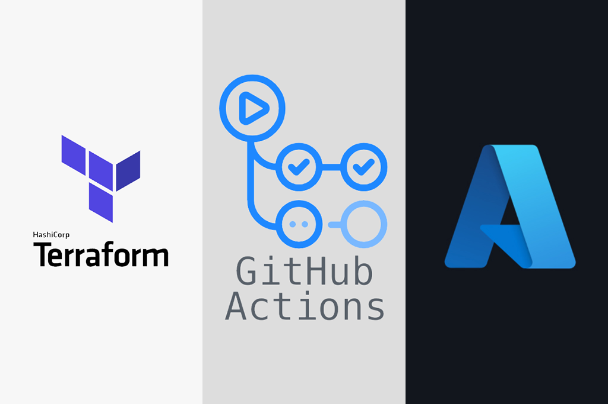

# terraform-azurerm-jmusicbot

  [](https://github.com/RCFromCLE/terraform-azurerm-jmusicbot/actions/workflows/update-jar.yml)
 [](https://github.com/RCFromCLE/terraform-azurerm-jmusicbot-config/actions/workflows/trigger-terraform-apply.yml)
[](https://github.com/RCFromCLE/terraform-azurerm-jmusicbot-config/actions/workflows/deploy-function.yml)



## Introduction

This Terraform module deploys JMusicBot on Azure, offering a robust and cost-effective solution for Discord server owners while serving as an excellent practice project for Azure-Terraform platform engineers. For optimal performance and security, deployment and management of this module via Terraform Cloud is strongly recommended.

If deploying, start with the configuration repo here - [terraform-azurerm-jmusicbot-config](https://github.com/RCFromCLE/terraform-azurerm-jmusicbot-config).

### What is JMusicBot?


JMusicBot is an open-source Discord music bot that plays music in voice channels from various sources, primarily YouTube. It is a Java application that requires a Linux or Windows machine to run. The bot is controlled via commands in a Discord text channel. For more information, see the [JMusicBot Wiki](https://jmusicbot.com/).

### Project Origin

Initially running JMusicBot locally, I found it unsustainable as the bot went offline whenever I did. I moved to Azure with a standard B1ms VM, which worked for a while but cost $20-30 per month. To reduce costs, I implemented an Azure Function to start and stop the VM based on user activity in the music channel, lowering the cost to zero when the bot was not in use. I then automated updates using GitHub Actions and Terraform Cloud. This project aims to provide a fully automated solution for running JMusicBot on Azure with minimal cost and maintenance and to serve as a practical project for learning Azure, Terraform, and GitHub Actions.

Future enhancements include adding features such as tracking the top ten songs and users and automating the Discord bot token rotation to address issues of token revocation due to suspected abuse. Currently, token rotation must be done manually in the Terraform Cloud workspace.

### Key Features

- **Complete Infrastructure**: Sets up all necessary Azure resources for running JMusicBot.
- **Automated Lifecycle Management**: Utilizes an Azure Function (`jdiscord-function`) to dynamically manage the VM.
  - Starts the VM when users join the music channel.
  - Stops the VM when all users leave voice channels.
  - Starts the VM when at least one user is in the music channel.
  - Ignores users in the AFK channel.
  - Respond to manual "start music bot" commands.
- **Continuous Updates**: Includes a GitHub Actions workflow to keep JMusicBot up-to-date with the latest releases.

  [](https://github.com/RCFromCLE/terraform-azurerm-jmusicbot/actions/workflows/update-jar.yml)

- **Fully Automated Deployment**: The "Check for Module Update and TF Apply" action in the configuration repository can automatically apply new releases created by the update-jar-and-release action. There is also a GitHub Action to deploy the function app in the configuration repository.

  [](https://github.com/RCFromCLE/terraform-azurerm-jmusicbot-config/actions/workflows/trigger-terraform-apply.yml)

- **Secure Configuration**: Sensitive variables are stored securely in Terraform Cloud or `terraform.tfvars`, Key Vault, and GitHub Actions secrets. See the configuration repository for details on using Azure Key Vault, Terraform Cloud workspace variables, variable sets, and GitHub Actions secrets to secure sensitive information.
- **Cost-Effective**: Utilizes serverless computing with Azure Functions. The consumption-based pricing model ensures you only pay for what you use, and your first 1 million requests are free. This solution will never come close to that limit, resulting in zero cost for the Azure Function.
- **Real-World Application**: Combines Infrastructure as Code, an open-source Java app, serverless computing, and CI/CD practices in a practical project.

### Requirements

To use this module, you'll need:

1. **Azure Subscription**: An active Azure subscription with sufficient permissions to create resources. A new subscription is recommended for this project, but you can use an existing subscription with the necessary custom permissions for the service principal.
2. **Terraform**: Version 0.12 or later installed on your local machine. [Setup Terraform on Windows](https://developer.hashicorp.com/terraform/tutorials/aws-get-started/install-cli)
3. **Terraform Cloud Account**: For state management, secure variable storage, and update workflows. Sign up for a free account at [Terraform Cloud](https://app.terraform.io/signup/account).
4. **Azure Service Principal**: An Azure registered application and secret with contributor access to your JDiscordBot created or existing Azure subscription. 
The following information is required:
   - Client ID
   - Client Secret
   - Tenant ID
   - Subscription ID
5. **Discord Bot**: A created Discord bot with the following:
   - Bot Token (for authentication to your Discord server)
   - Bot Owner ID (your personal Discord ID)
   - General Channel ID (for future updates)
   - Music Channel ID (for bot communication)
   - AFK Channel ID (bot will ignore users in this channel)

   See the [JMusicBot Wiki](https://jmusicbot.com/getting-a-bot-token/) for more information on setting up a Discord bot.

6. **GitHub Account**: Required for the automated update workflow and forked configuration repository.
7. **Azure CLI**: Installed and configured for local testing and deployment.
8. **VS Code** (recommended): With the following extensions:
   - Azure Tools
   - PowerShell
   - GitHub Actions
   - Terraform - HashiCorp
   - HCP - Terraform

9. **Configuration Repository**: A forked copy of the [terraform-azurerm-jmusicbot-config](https://github.com/RCFromCLE/terraform-azurerm-jmusicbot-config) repository for managing the infrastructure configuration.

Ensure all these components are set up before attempting to deploy the module. Refer to the configuration repository for detailed setup instructions.

### Usage

**Attention**: This module is designed to run within a Terraform Cloud workspace in concert with the jdiscord-kv workspace. See the configuration repository [terraform-azurerm-jmusicbot-config](https://github.com/RCFromCLE/terraform-azurerm-jmusicbot-config) for detailed setup instructions.

1. Configure Terraform Cloud block iin your main.tf files:

```hcl
terraform {
  cloud {
    organization = "YourOrganization"
    workspaces {
      name = "azure-jmusicbot"
    }
  }
  required_providers {
    azurerm = {
      source  = "hashicorp/azurerm"
      version = "~>3.0"
    }
    tls = {
      source  = "hashicorp/tls"
      version = "~>4.0"
    }
  }
}
```

2. In your Terraform configuration, reference the [Terraform Registry page](https://registry.terraform.io/modules/RCFromCLE/jmusicbot/azure/latest) for this module. 

  - Below is an example configuration:

```hcl
"jmusicbot" {
  source  = "RCFromCLE/jmusicbot/azure"
  version = "latest_jmusicbot_module_version_here"

  # Required variables
  azure_tenant_id     = var.azure_tenant_id
  sub                 = var.sub
  discord_bot_token   = var.discord_bot_token
  discord_bot_owner   = var.discord_bot_owner
  general_channel_id  = var.general_channel_id
  music_channel_id    = var.music_channel_id
  afk_channel_id      = var.afk_channel_id
  azure_client_id     = var.azure_client_id
  azure_client_secret = var.azure_client_secret

  # Optional variables
  rg                    = var.rg
  rg_loc                = var.rg_loc
  net                   = var.net
  subnet                = var.subnet
  pub_ip                = var.pub_ip
  nic_name              = var.nic_name
  nsg                   = var.nsg
  vm_name               = var.vm_name
  vm_size               = var.vm_size
  vm_image_publisher    = var.vm_image_publisher
  vm_image_offer        = var.vm_image_offer
  vm_image_sku          = var.vm_image_sku
  vm_image_version      = var.vm_image_version
  os_disk_name          = var.os_disk_name
  vm_admin_username     = var.vm_admin_username
  discord_bot_prefix    = var.discord_bot_prefix
}
```

3. Provide values for the required variables in your Terraform Cloud workspace or `terraform.tfvars` file. You can use set_workspace_variable.ps1 to set the variables in the TF Cloud Workspace. Simply fill out your Terraform API token, place the script in the same directory as terraform.tfvars and run the script.

##  Resources Deployed

This module deploys the following Azure resources:

1. **Resource Group**: Contains all deployed resources
2. **Virtual Network**: Network infrastructure for the VM
3. **Subnet**: Subnetwork within the VNet for the VM
4. **Network Security Group**: Defines inbound and outbound security rules
5. **Public IP**: Allocates a public IP address for the VM
6. **Network Interface**: Virtual network interface for the VM
7. **Linux Virtual Machine**: Hosts the JMusicBot application
8. **Virtual Machine Extension**: Custom script extension to set up JMusicBot
9. **Storage Account**: Used by the Function App
10. **App Service Plan**: Hosts the Function App
11. **Application Insights**: Provides monitoring for the Function App
12. **Function App**: Hosts the Node.js function that manages VM lifecycle

### Variables

| Variable | Type | Description | Default |
|----------|------|-------------|---------|
| `azure_tenant_id` | string | The tenant ID of the Azure Service Principal | |
| `sub` | string | The subscription ID of the Azure subscription | |
| `discord_bot_token` | string | The Discord bot token | |
| `discord_bot_owner` | string | The owner ID for the Discord bot | |
| `general_channel_id` | string | The channel ID of the general channel in the Discord server | |
| `music_channel_id` | string | The channel ID of the music channel in the Discord server | |
| `afk_channel_id` | string | The channel ID of the AFK channel in the Discord server | |
| `azure_client_id` | string | The client ID of the Azure Service Principal | |
| `azure_client_secret` | string | The client secret of the Azure Service Principal | |
| `rg` | string | The name of the resource group | "jdiscordbot-rg" |
| `rg_loc` | string | The location of the resource group | "eastus" |
| `net` | string | The name of the virtual network | "jdiscordbot-vnet" |
| `subnet` | string | The name of the subnet | "jdiscordbot-snet" |
| `pub_ip` | string | The name of the public IP | "jdb-pub_ip" |
| `nic_name` | string | The name of the network interface | "jdb-nic" |
| `nsg` | string | The name of the network security group | "jdb-nsg" |
| `vm_name` | string | The name of the virtual machine | "jdb-vm" |
| `vm_size` | string | The size of the virtual machine | "Standard_B1ms" |
| `vm_image_publisher` | string | The publisher of the VM image | "canonical" |
| `vm_image_offer` | string | The offer of the VM image | "ubuntuserver" |
| `vm_image_sku` | string | The SKU of the VM image | "18_04-lts-gen2" |
| `vm_image_version` | string | The version of the VM image | "18.04.202103250" |
| `os_disk_name` | string | The name of the OS disk | "os-disk" |
| `vm_admin_username` | string | The admin username for the VM | "rc" |
| `discord_bot_prefix` | string | The command prefix for the Discord bot | "!" |


Certainly, I'll reformat the content to make it easier to read and follow using markdown. Here's the improved version:

## GitHub Actions Workflow: update-jar-and-release

#### Overview
This workflow automates the update process for the `terraform-azurerm-jmusicbot` module. It checks for new JMusicBot releases, updates the `variables.tf` file if a new version is available, and creates a new release in the repository.

#### Workflow Details

###### File: `update-jar.yml`

#### Triggers
- **Scheduled**: Daily at 5 AM EST (`0 10 * * *`)
- **Manual**: Can be triggered via `workflow_dispatch`

#### Job: check-and-update-jar
**Runs on**: `ubuntu-latest`

#### Steps

1. **Checkout Repository**
   - Action: `actions/checkout@v2`
   - Clones the `terraform-azurerm-jmusicbot` repository with full history

2. **Get Current Version from variables.tf**
   - Extracts current JMusicBot version from `variables.tf`
   - Output: `current_version`

3. **Check for New MusicBot Release**
   - Fetches latest JMusicBot release version from GitHub API
   - Output: `new_version`

4. **Update JAR File**
   - Compares `current_version` with `new_version`
   - If new version found:
     - Updates `variables.tf` with new version
     - Configures Git user settings
     - Commits and pushes changes
     - Sets `updated` to `true`
   - If no new version:
     - Sets `updated` to `false`

5. **Exit if No New Release Found**
   - Exits workflow if `updated` is `false`

6. **Get Latest Release Version**
   - Retrieves latest release version from `terraform-azurerm-jmusicbot` repo
   - Increments patch version (e.g., `v1.2.3` to `v1.2.4`)
   - Output: `new_version`

7. **Create Release**
   - If `updated` is `true`:
     - Creates new release in `terraform-azurerm-jmusicbot` repo
     - Uses new version tag
     - Includes release notes with updated JMusicBot version

#### Target Repository
https://github.com/jagrosh/JMusicBot

#### Outcome
This workflow ensures the `terraform-azurerm-jmusicbot` module always uses the latest version of JMusicBot by automatically updating the configuration file and creating a new release when a new version is detected.

## Function App

The config repo includes an Azure Function (`jdiscord-function/index.js`) that manages the VM lifecycle based on Discord activity. 

[](https://github.com/RCFromCLE/terraform-azurerm-jmusicbot-config/actions/workflows/deploy-function.yml)

The Javascript function:

- Monitors Discord voice channels
- Starts the VM when users join the music channel
- Stops the VM when all users leave voice channels
- Starts the VM when at least one user is in the music channel
- Ignores users in the AFK channel
- Responds to manual "start music bot" commands

Future enhancements include tracking the top ten songs and users, replaying the top ten songs, cost analysis, and cost updates.


### Configuration Repository

For detailed setup instructions and a complete configuration example, refer to the [terraform-azurerm-jmusicbot-config](https://github.com/RCFromCLE/terraform-azurerm-jmusicbot-config) repository.

### Notes

- Ensure your Azure service principal has the necessary permissions  (contributor over your JMusicBot subscription) to create resources.
- See the configuration repository action called "Check for Module Update and TF Apply" for how to apply the new release created by update-jar-and-release action
- Keep sensitive variables secure in Terraform Cloud or `terraform.tfvars` never in `variables.tf` as it could be exposed in the GitHub repository.
- Forking this module is not necessary unless you have specific security requirements

### Contributing

Contributions are welcome! Please submit pull requests with any enhancements or bug fixes.
